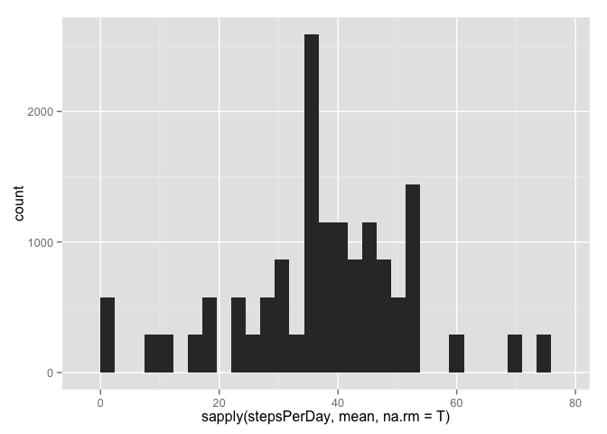
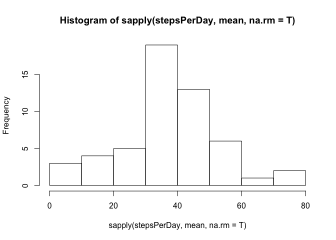

# Reproducible Research: Peer Assessment 1


## Loading and preprocessing the data

* I'm going to load the data from a CSV file into a data frame in the main memory; to perform the rest of the analysis on it.

* I chose to convert it into a data frame in order to make it easy, to use the data with the ggplot2 plotting system.


```r
healthData <- read.csv(unz("activity.zip", "activity.csv"), header = T)
str(healthData)
```

```
## 'data.frame':	17568 obs. of  3 variables:
##  $ steps   : int  NA NA NA NA NA NA NA NA NA NA ...
##  $ date    : Factor w/ 61 levels "2012-10-01","2012-10-02",..: 1 1 1 1 1 1 1 1 1 1 ...
##  $ interval: int  0 5 10 15 20 25 30 35 40 45 ...
```

## What is mean total number of steps taken per day?

* get the total number of steps taken per day


```r
stepsPerDay <- split(healthData$steps, healthData$date)
#head(stepsPerDay)
```

* First I'll help visualize the total number of steps taken each day, using a histogram.


```r
library(ggplot2)
h <- ggplot(healthData, aes(x= sapply(stepsPerDay, mean, na.rm = T)))
h + geom_histogram()
```

```
## Warning in data.frame(x = structure(c(NaN, 0.4375, 39.4166666666667,
## 42.0694444444444, : row names were found from a short variable and have
## been discarded
```

```
## stat_bin: binwidth defaulted to range/30. Use 'binwidth = x' to adjust this.
```

 


```r
hist(sapply(stepsPerDay, mean, na.rm = T))
```

 


## What is the average daily activity pattern?


## Imputing missing values


## Are there differences in activity patterns between weekdays and weekends?
