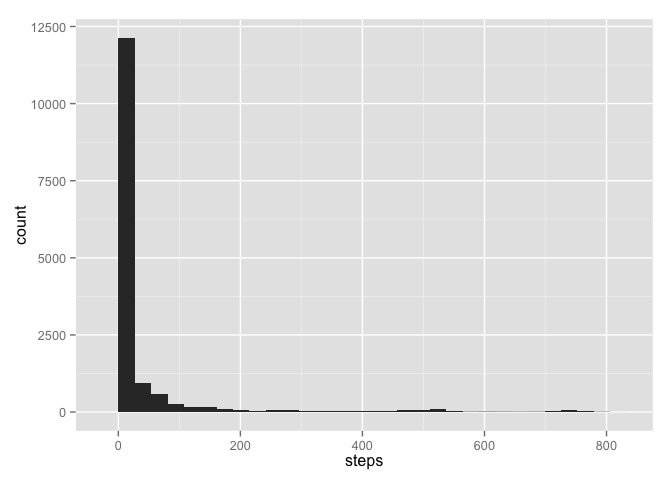

# Reproducible Research: Peer Assessment 1


## Loading and preprocessing the data

* I'm going to load the data from a CSV file into a data frame in the main memory; to perform the rest of the analysis on it.

* I chose to convert it into a data frame in order to make it easy, to use the data with the ggplot2 plotting system.


```r
healthData <- read.csv2("./activity.csv", sep = ",")
head(healthData)
```

```
##   steps       date interval
## 1    NA 2012-10-01        0
## 2    NA 2012-10-01        5
## 3    NA 2012-10-01       10
## 4    NA 2012-10-01       15
## 5    NA 2012-10-01       20
## 6    NA 2012-10-01       25
```

## What is mean total number of steps taken per day?

* First I'll help visualize the total number of steps taken each day, using a histogram.


```r
library(ggplot2)
h <- ggplot(healthData, aes(x = steps)) 
h + geom_histogram()
```

```
## stat_bin: binwidth defaulted to range/30. Use 'binwidth = x' to adjust this.
```

 


## What is the average daily activity pattern?


## Imputing missing values


## Are there differences in activity patterns between weekdays and weekends?
